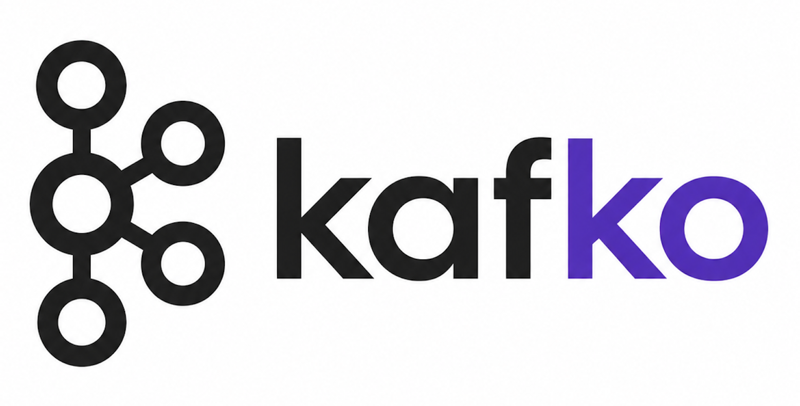

<p align="center">
  
</p>

<h1 align="center">kafko</h1>

<p align="center"><em>speak Kafka from your terminal</em></p>

A modern, container-friendly Kafka CLI written in Go. Produce, consume, and inspect Kafka topics with a Unix pipe philosophy. **No JVM. No librdkafka.** Just a single static binary, ~5 MB, ready to drop into any container.

**Build**
[](https://github.com/darioajr/kafko/actions/workflows/ci.yaml)
[](https://github.com/darioajr/kafko/actions/workflows/release.yaml)

**Release & Containers**
[](https://github.com/darioajr/kafko/releases/latest)
[](https://hub.docker.com/r/darioajr/kafko)
[](https://hub.docker.com/r/darioajr/kafko)
[](https://hub.docker.com/r/darioajr/kafko)
[](https://github.com/darioajr/kafko/pkgs/container/kafko)
[](https://quay.io/repository/darioajr/kafko)

**Code**
[](go.mod)
[](https://goreportcard.com/report/github.com/darioajr/kafko)

**License**
[](LICENSE)
[](https://app.fossa.com/projects/git%2Bgithub.com%2Fdarioajr%2Fkafko?ref=badge_shield)
---

## Why kafko?

`kcat` (formerly `kafkacat`) is the de-facto Kafka swiss army knife — but it's written in C and depends on `librdkafka`. That makes static builds painful and Docker images bloated. **kafko** is a clean-slate rewrite around [`franz-go`](https://github.com/twmb/franz-go), the only fully native Kafka client outside the JVM.

| | kcat | kafko |
|---|---|---|
| Language | C | Go |
| Kafka client | librdkafka (C) | franz-go (pure Go) |
| Static binary | hard | trivial (`CGO_ENABLED=0`) |
| Docker image | ~80 MB | ~5 MB (`FROM scratch`) |
| Cross-compile | painful | `GOOS=linux GOARCH=arm64 go build` |
| Config profiles | `-F` file | TOML profiles (`~/.config/kafko/config.toml`) |
| Output formats | raw, JSON | raw, JSON (pretty + colored), hex, base64, **MessagePack**, **Protobuf** |
| Interactive mode | — | **TUI** (bubbletea) |
| Auth | SASL, TLS | SASL (PLAIN / SCRAM 256/512), TLS, mTLS |

---

## Install

### Homebrew (macOS / Linux)

```sh
brew install darioajr/tap/kafko
```

### Linux packages (.deb / .rpm / .apk)

Native packages for `linux/amd64` and `linux/arm64` are attached to every [release](https://github.com/darioajr/kafko/releases). Replace `<ver>` with the release version (e.g. `0.3.1`) and `<arch>` with `amd64` or `arm64`.

```sh
# Debian / Ubuntu
curl -LO https://github.com/darioajr/kafko/releases/latest/download/kafko_<ver>_linux_<arch>.deb
sudo dpkg -i kafko_*.deb

# RHEL / Fedora / Rocky / Alma
sudo rpm -i https://github.com/darioajr/kafko/releases/latest/download/kafko_<ver>_linux_<arch>.rpm

# Alpine
curl -LO https://github.com/darioajr/kafko/releases/latest/download/kafko_<ver>_linux_<arch>.apk
sudo apk add --allow-untrusted kafko_*.apk

# Arch / Manjaro
curl -LO https://github.com/darioajr/kafko/releases/latest/download/kafko_<ver>_linux_<arch>.pkg.tar.zst
sudo pacman -U kafko_*.pkg.tar.zst
```

The binary lands at `/usr/bin/kafko`; docs at `/usr/share/doc/kafko/`.

### Go

```sh
go install github.com/darioajr/kafko/cmd/kafko@latest
```

### Docker

Multi-arch images (`linux/amd64`, `linux/arm64`) are published on every release to **three registries** — pick whichever your environment trusts:

```sh
docker run --rm -it ghcr.io/darioajr/kafko:latest    --help   # GitHub Container Registry
docker run --rm -it docker.io/darioajr/kafko:latest  --help   # Docker Hub
docker run --rm -it quay.io/darioajr/kafko:latest    --help   # Quay.io
```

### Pre-built binaries

Grab the archive for your OS/arch from the [releases page](https://github.com/darioajr/kafko/releases). Each release ships:

| OS      | amd64 | arm64 |
|---------|:-----:|:-----:|
| Linux   |   ✓   |   ✓   |
| macOS   |   ✓   |   ✓   |
| Windows |   ✓   |   ✓   |

---

## Quick start

```sh
# tail a topic from the latest offset
kafko consume -b localhost:9092 -t orders

# from the beginning, JSON pretty-printed and colorized
kafko consume -b localhost:9092 -t orders --from-beginning -f json --pretty

# pipe-friendly: 100 messages then quit, key + value separated by tab
kafko consume -b localhost:9092 -t orders -K -n 100 | head

# produce from stdin (one record per line)
echo '{"id":1,"total":42.0}' | kafko produce -b localhost:9092 -t orders

# produce with key extracted by separator and a header
echo "user-1:hello" | kafko produce -b localhost:9092 -t greetings -K --key-separator=":" -H source=cli
```

---

## Profiles

Drop a TOML file at `$XDG_CONFIG_HOME/kafko/config.toml` (default `~/.config/kafko/config.toml`):

```toml
default_profile = "local"

[profiles.local]
brokers = ["localhost:9092"]

[profiles.staging]
brokers = ["kafka.staging.internal:9093"]
tls = true
sasl_mechanism = "SCRAM-SHA-512"
sasl_username  = "kafko"
# password via env: KAFKO_SASL_PASSWORD

[profiles.msk]
brokers = ["b-1.msk.amazonaws.com:9094"]
tls = true
sasl_mechanism = "SCRAM-SHA-512"
sasl_username = "app"
```

Then:

```sh
kafko -c staging consume -t orders
KAFKO_SASL_PASSWORD=… kafko -c msk topics list
```

CLI flags always win over profile values.

---

## Commands

```text
kafko consume    # tail topics
kafko produce    # publish from stdin
kafko topics     # list / describe / create / delete
kafko groups     # list / describe consumer groups
kafko metadata   # cluster + broker info
kafko tui        # interactive browser
kafko version
```

Run `kafko <cmd> --help` for the full flag set.

---

## Output formats

| Format | Description |
|---|---|
| `raw` (default) | Value bytes, optional key + tab + value, headers in `[k=v,…]` |
| `json` | Newline-delimited JSON. Add `--pretty` for indent + ANSI colors (chroma) |
| `hex` | Hex-encoded value (and key with `-K`) |
| `base64` | Base64-encoded value (and key with `-K`) |
| `msgpack` | Decode MessagePack and render as JSON |
| `proto` | Decode Protobuf via descriptor file (`--proto-file`, `--proto-message`) |

### Protobuf example

Generate a descriptor set:

```sh
protoc --include_imports --descriptor_set_out=order.desc order.proto
```

Then:

```sh
kafko consume -t orders -f proto \
  --proto-file=order.desc --proto-message=com.example.Order --pretty
```

---

## TUI mode

```sh
kafko tui
```

* Lists topics with partition counts.
* `enter` to tail a topic.
* `/` to filter messages by substring (key or value).
* `c` clears the buffer, `esc` returns to topic list.
* `q` / `ctrl+c` quits.

---

## Authentication

```sh
# TLS (CA only)
kafko consume --tls --tls-ca=ca.pem -t orders

# mTLS
kafko consume --tls --tls-ca=ca.pem --tls-cert=client.pem --tls-key=client.key -t orders

# SASL/PLAIN
KAFKO_SASL_PASSWORD=secret kafko consume \
  --tls --sasl-mechanism=PLAIN --sasl-username=app -t orders

# SASL/SCRAM-SHA-512
KAFKO_SASL_PASSWORD=secret kafko consume \
  --tls --sasl-mechanism=SCRAM-SHA-512 --sasl-username=app -t orders
```

---

## Docker

The image is built `FROM scratch` with CA roots and a non-root user — nothing else.

```sh
docker run --rm -it --network=host ghcr.io/darioajr/kafko:latest \
  consume -b localhost:9092 -t orders --from-beginning -n 10
```

To bake a profile in:

```sh
docker run --rm -it \
  -v $HOME/.config/kafko:/home/nonroot/.config/kafko:ro \
  -e XDG_CONFIG_HOME=/home/nonroot/.config \
  ghcr.io/darioajr/kafko:latest -c staging topics list
```

---

## Building from source

```sh
git clone https://github.com/darioajr/kafko.git
cd kafko
make build      # ./bin/kafko
make test       # unit tests with race detector
make snapshot   # goreleaser local cross-build (linux/darwin/windows × amd64/arm64)
```

Requires Go 1.23+.

---

## Roadmap

- [ ] Avro decoder via Confluent Schema Registry
- [ ] Avro decoder via Apicurio Schema Registry
- [ ] OAUTHBEARER (incl. AWS MSK IAM)
- [ ] Plugin pipeline (WASM transforms on records)
- [x] `kafko tap` — durable replicator between clusters
- [ ] Web UI (`kafko serve`) sharing the same engine

---

## Contributing

PRs welcome — see [CONTRIBUTING.md](CONTRIBUTING.md). By participating in this project you agree to abide by the [Code of Conduct](CODE_OF_CONDUCT.md).

Release history is tracked in [CHANGELOG.md](CHANGELOG.md).

## License

[MIT](LICENSE) © Dario Alves Junior

[](https://app.fossa.com/projects/git%2Bgithub.com%2Fdarioajr%2Fkafko?ref=badge_large)

---

*Inspired by [`kcat`](https://github.com/edenhill/kcat). Powered by [`franz-go`](https://github.com/twmb/franz-go), [`cobra`](https://github.com/spf13/cobra), and [`bubbletea`](https://github.com/charmbracelet/bubbletea).*


[](https://app.fossa.com/projects/git%2Bgithub.com%2Fdarioajr%2Fkafko?ref=badge_large)